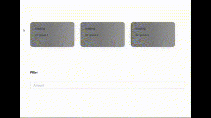

# Simple Cards and Transactions Overview
## ------------------------------- Specs -------------------------------

## Task

The purpose of this task is to build a card and transactions overview page.
The user should be able to select one of the cards, see its transactions and be able to filter the transactions based on the amount.

The image in the folder /docs, it gives a visual overview of how the page is intended to look like.

## Notes

- `yarn`.
- Typescript
- A fake ApiClient is provided to fetch the data.
- Design can be adjusted as needed.

## AC

- User can select one of the cards.
- The transactions of the selected card will be displayed.
- The transactions have the same background color as the selected card.
- There should be a filter field between the cards and the transactions.
- The user can filter transactions by inputting the amount to the filter field. Transactions with the amount in the field or greater should be left visible.

## ------------------------------- MY NOTES -------------------------------

## How to run
1. install dependencies: `yarn `
2. run in dev mode: `yarn dev`

## THE STACK
- yarn + React + Vite + Typescript
- Eslint + prettier, for clean code
- styled components
- vitest + React Testing Library, for testing

## My notes
I tried to lay out a base that could potentially be built upon.
- I set up a simple design system/theme for design consistency
- I simulated a flow with fetching, success and error states (for this purpose I added some extra data - one card doesn't have corresponding transactions; and I added a simulated delay in the fake APIs)
- I moved all the 'fetching' and filtering logic into custom hooks (cards and transactions)
- I created a simple state management system (using React Context) to avoid prop drilling, maybe overkill for the current setup.

In terms of the Design I made some changes, as I assumed that the cards.length could potentially be > 2.

- Assuming that the card list is > 2 (my choice)

I created a horizontally scrollable container, where the user can select one of the cards, the selected car will scroll to center position and change color.
User can scroll with scroll arrows or via keyboard.

- Assuming that cards.length === 2

I would still tweak it slightly:
I would make whatever card is not selected a bit smaller,
so it would look like it was in the background, to reinforce which transactions the user is seeing.

## Nice to-haves
- Add extensive testing
- add translation/copy files, with i18n or similar
- improve mobile responsiveness
- add error boundary

- backend with nestjs

## Screenshots 
