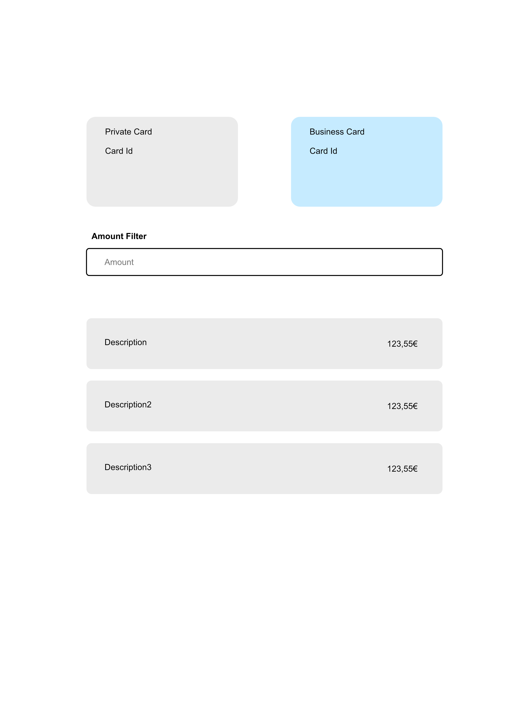

# TASK-101 Cards and Transactions Overview
## ------------------------------- THE INSTRUCTIONS -------------------------------

Hellow there!😁 first of all, thanks for taking the time and your interest in joining Code Factory!
As part of joining our engineering, we share this simple challenge with you.

Happy coding!

## Task

The purpose of this task is to build a card and transactions overview page. The user should be able to select one of the cards, see it's transactions and be able to filter the transactions based on the amount.

You will find an image in the folder /docs, it gives a visual overview of how the page is intended to look like.



## Notes

Please install dependencies using `yarn`. ✅

Typescript is a must. ✅

We provided a fake ApiClient for you that fetches the data. If you want to improve this client and adjust it to your needs feel free to do so.

You can always extend with more data if you feel like it.

If you feel like the design does not make sense, adjust it and note how you would communicate your suggestions with a designer.

## AC

- User can select one of the cards ✅
- The transactions of the selected card will be displayed.✅
- The transactions have a same background color than the card. ✅
- There should be a filter field between the cards and the transactions. ✅
- The user can filter transactions by inputting amount to the filter fields. Transactions with the amount in the fields or greater should be left visible. ✅

## Deliverables

- Share with us a zip file wtih your source code excluding the node_modules folder


## ------------------------------- MY NOTES -------------------------------
## How to run
1. install dependencies: `yarn `
2. run in dev mode: `yarn dev`

## THE STACK
- yarn + React + Vite + Typescript
- Eslint + prettier, for clean code
- styled components, for flexibility, straight forward implementation and consistent design
  ```
  src/
  ├── styles/
  │   ├── theme.ts              // theme object
  │   ├── globalStyles.ts       
  │   └── components/           // reusable styled components
  │       ├── generic.ts
  │       ├── input.ts
  ├── providers/
  │   └── ThemeProvider.tsx     // theme provider setup
  └── ...
  ```

## My notes

Hi there!
this is my take on the Task :).

Since it was a small challenge I decided to focus on the aspects that I thought would be most relevant for this type of component.
I tried to lay out a base that could potentially be build upon.
- I set up a simple design system/theme for design consistency
- I simulated a flow with fetching, success and error states (for this purpose I added some extra data - one card doesn't have corresponding transactions; and I added a simulated delay in the fake APIs)
- I build most of the ui directly in App.tsx for simplicity
- I moved all the 'fetching' and filtering logic into a custom hook (`src/hooks/useCardsAndTransactions`) to keep App.tsx a bit cleaner

In terms of the Design I made some changes, as I assumed that the cards.length could potentially be > 2.
In normal circumstances I would of course clarify with the BE devs first :)

- Assuming that the card list is > 2 (my choice)

Assuming a user could have more than 2 cards, I would propose to the Designer to have the selected card on the left, with primary color background,

And have the other cards inside a scrollable container with fixed height, where the user can "browse" all the other selectable cards,
that are a bit smaller and of different color


- Assuming that cards.length === 2

I would talk with the Designer about tweaking the design slightly:
I would make whatever card is not selected a bit smaller,
so it would look like it was in the background, to reinforce which transactions the user is seeing.


## Nice to-haves
What I didn't do, in the spirit of keeping the task within a smaller timeframe, but that would be nice to have
- Add extensive testing
- add translation/copy files, with i18n or similar
- add mobile responsiveness?
- add error boundary?
- dockerize the app?


Thank you for taking the time to review my Task!

## Screenshots 


